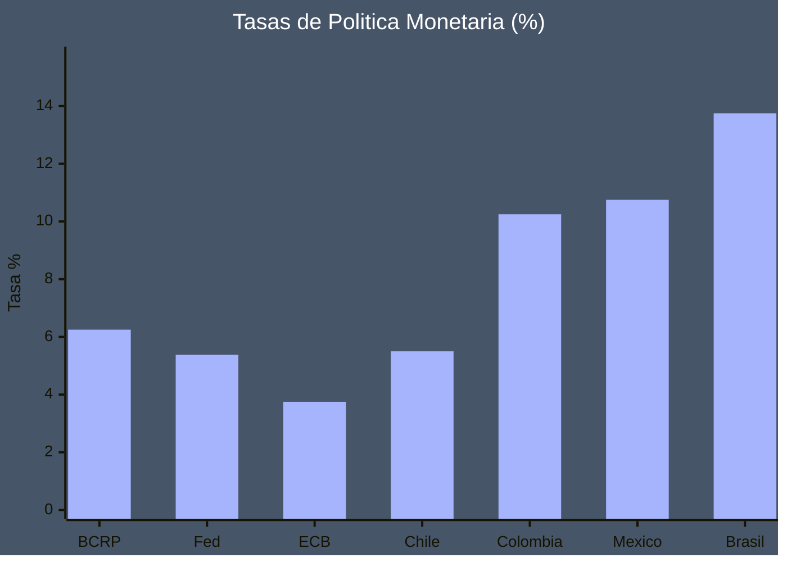
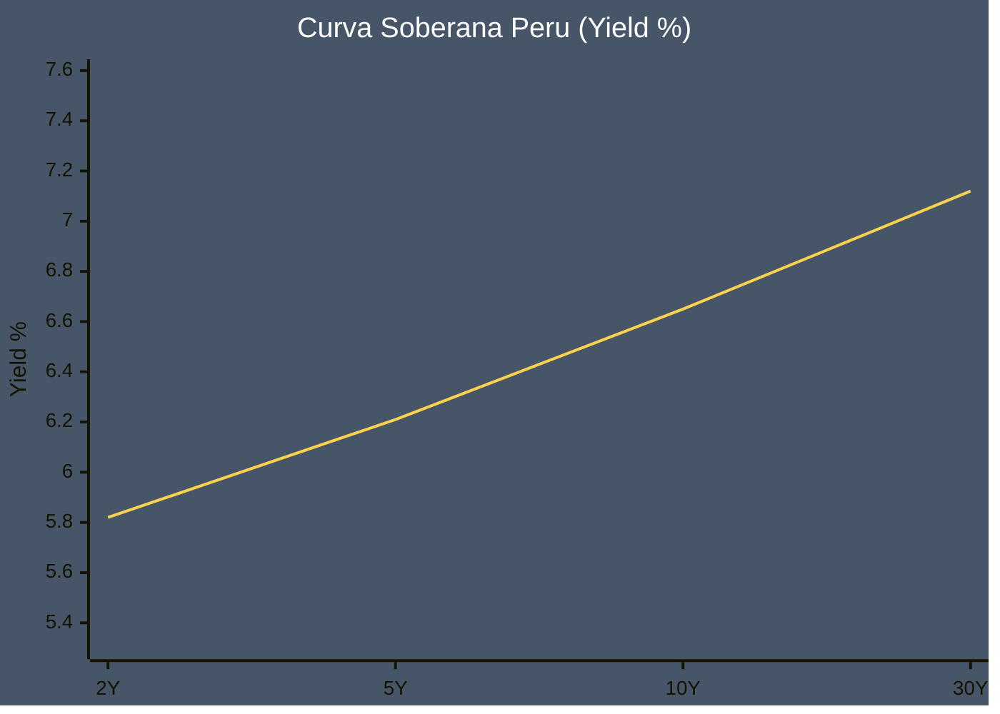
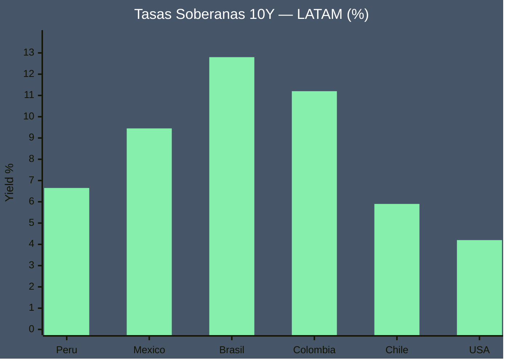
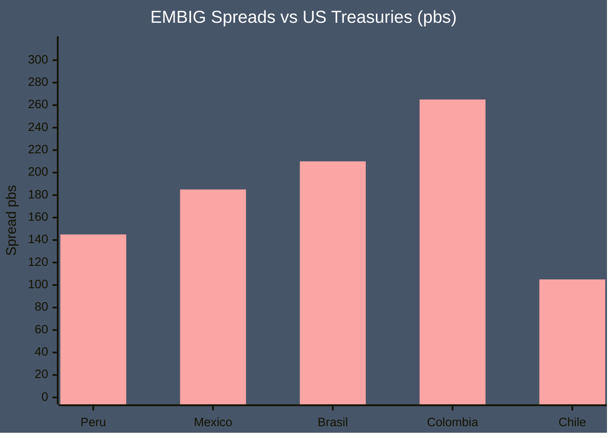
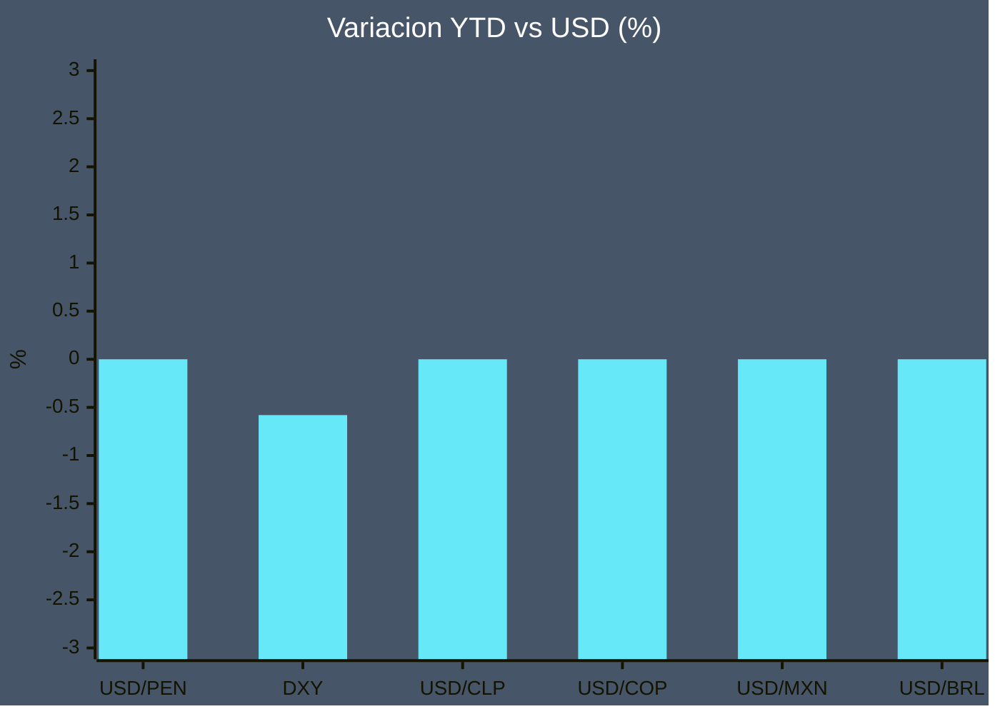
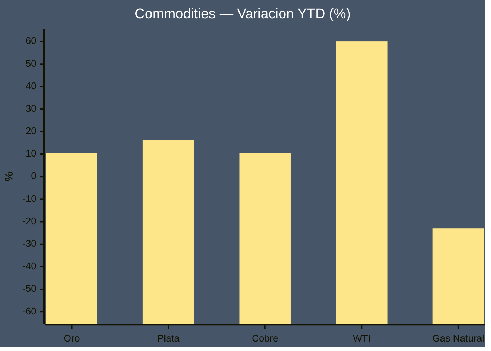
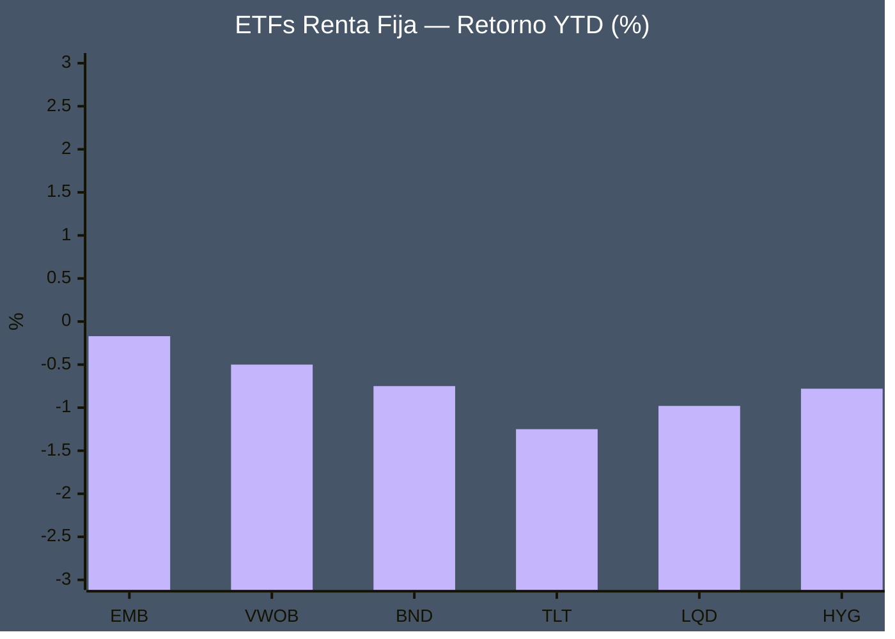
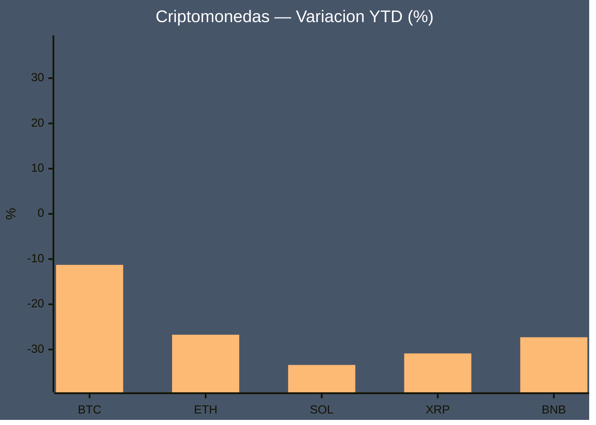
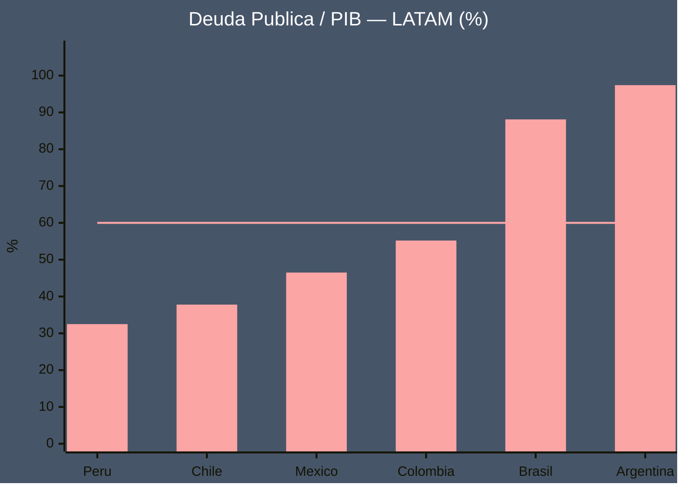

# Tablero Financiero LATAM — 2026-05-07

> [!abstract]+ Resumen del dia
> - **USD/PEN** 3.4564 (-0.21% dia)
> - **Oro** USD 4764.10/oz (+1.49% dia)
> - **BTC** USD 79,809 (-2.30% 24h)
> - **Mejor indice** NASDAQ +0.42%
> - **Peor indice** MSCI LATAM -1.52%
> - **Tasa BCRP** 6.25% *(est.)*

> [!warning] Alerta de mercado
> WTI cae 3.55% — impacto potencial en inflacion importada.

## Tasas de Politica Monetaria

| Banco Central | Tasa (%) | Cambio | Tendencia |
| ------------- | -------: | -----: | :-------: |
| BCRP *(est.)* | **6.25** | 0 pbs | → |
| Fed *(est.)* | **5.38** | -25 pbs | ↓ |
| ECB *(est.)* | **3.75** | -25 pbs | ↓ |
| Chile *(est.)* | **5.50** | -25 pbs | ↓ |
| Colombia *(est.)* | **10.25** | -25 pbs | ↓ |
| Mexico *(est.)* | **10.75** | -25 pbs | ↓ |
| Brasil *(est.)* | **13.75** | +25 pbs | ↑ |

> [!note] Contexto de politica monetaria
> La tasa BCRP se encuentra en **6.25%** *(est.)*. El ciclo de recortes en LATAM continua con distintas velocidades segun dinamica inflacionaria local. La Fed mantiene una postura restrictiva con impacto sobre flujos de capital hacia emergentes.

## Bonos Soberanos

### Curva Soberana Peru

| Plazo | Rendimiento (%) | Semana | Mes |
| :---: | --------------: | -----: | --: |
| 2Y *(est.)* | **5.82** | -3 pbs | -8 pbs |
| 5Y *(est.)* | **6.21** | -2 pbs | -5 pbs |
| 10Y *(est.)* | **6.65** | +1 pbs | +3 pbs |
| 30Y *(est.)* | **7.12** | +2 pbs | +5 pbs |

### Tasas 10Y Regionales

| Pais | Yield 10Y (%) |
| ---- | ------------: |
| Peru *(est.)* | 6.65 |
| Mexico *(est.)* | 9.45 |
| Brasil *(est.)* | 12.80 |
| Colombia *(est.)* | 11.20 |
| Chile *(est.)* | 5.90 |
| USA | 4.20 |

### EMBIG Spreads (pbs)

| Pais | Spread EMBIG (pbs) |
| ---- | -----------------: |
| Peru | 145 |
| Mexico | 185 |
| Brasil | 210 |
| Colombia | 265 |
| Chile | 105 |

> [!success] Riesgo soberano Peru
> EMBIG spread de Peru en **145 pbs** — nivel bajo. Un spread menor indica menor percepcion de riesgo pais y costo de deuda mas competitivo.

## Divisas

| Par | Nombre | Precio | Dia | YTD |
| --- | ------ | -----: | --: | --: |
| **USD/PEN** | Sol Peruano | 3.4564 | ↓ -0.21% | N/A |
| **DXY** | Indice Dolar | 97.8520 | ↓ -0.17% | -0.58% |
| **USD/CLP** | Peso Chileno | 887.1200 | ↓ -0.52% | N/A |
| **USD/COP** | Peso Colombiano | 3728.6800 | ↑ +0.52% | N/A |
| **USD/MXN** | Peso Mexicano | 17.2298 | ↓ -0.07% | N/A |
| **USD/BRL** | Real Brasileno | 4.9231 | ↑ +0.01% | N/A |

> [!tip] Contexto DXY
> El indice dolar (DXY) cotiza en **97.85** — zona de debilidad. Un DXY alto presiona divisas emergentes y commodities denominados en USD.

## Indices Bursatiles

| Indice | Precio | Dia | YTD |
| ------ | -----: | --: | --: |
| S&P 500 | 7370.33 | ↑ +0.07% | +7.46% |
| NASDAQ | 25947.25 | ↑ +0.42% | +11.67% |
| Dow Jones | 49815.07 | ↓ -0.19% | +2.96% |
| BVL Peru | 0.00 | → N/A | N/A |
| MSCI LATAM | 36.40 | ↓ -1.52% | +18.07% |

### Materias Primas

| Commodity | Unidad | Precio | Dia | YTD |
| --------- | ------ | -----: | --: | --: |
| **Oro** | USD/oz | 4764.10 | ↑ +1.49% | +10.42% |
| **Plata** | USD/oz | 82.11 | ↑ +6.21% | +16.37% |
| **Cobre** | USD/lb | 6.23 | ↑ +0.63% | +10.38% |
| **WTI** | USD/bbl | 91.70 | ↓ -3.55% | +60.00% |
| **Gas Natural** | USD/MMBtu | 2.79 | ↑ +2.16% | -22.91% |

> [!note] Cobre y economia peruana
> El cobre cotiza en **USD 6.226/lb** — nivel alto. Peru es el segundo productor mundial: precio elevado impacta positivamente en exportaciones, recaudacion y tipo de cambio.

## ETFs Renta Fija

| Ticker | Nombre | Precio | YTD | Yield Est. | TER |
| :----: | ------ | -----: | --: | ---------: | --: |
| **EMB** | iShares EM Bond | 96.14 | ↓ -0.17% | 6.8% | 0.40% |
| **VWOB** | Vanguard EM Bond | 67.11 | ↓ -0.50% | 6.5% | 0.20% |
| **BND** | Vanguard Total Bond | 73.48 | ↓ -0.75% | 4.2% | 0.03% |
| **TLT** | iShares 20Y Treasury | 85.94 | ↓ -1.25% | 4.5% | 0.15% |
| **LQD** | iShares IG Corp Bond | 109.08 | ↓ -0.98% | 5.1% | 0.14% |
| **HYG** | iShares HY Corp Bond | 80.04 | ↓ -0.78% | 7.2% | 0.49% |

> [!tip] ETFs destacados
> - **Mejor YTD**: EMB — iShares EM Bond (-0.17%)
> - **Peor YTD**: TLT — iShares 20Y Treasury (-1.25%)
> - TLT y bonos largos son los mas sensibles a cambios en tasas Fed.

## Criptomonedas

> [!abstract] Market Cap Total Crypto: **USD 2,098.9B**

| Moneda | Precio USD | 24h | 7d | YTD | Market Cap |
| ------ | ---------: | --: | -: | --: | ---------: |
| **Bitcoin** (BTC) | 79,809.00 | ↓ -2.30% | N/A | -11.28% | USD 1,599.2B |
| **Ethereum** (ETH) | 2,289.01 | ↓ -3.04% | N/A | -26.73% | USD 276.7B |
| **Solana** (SOL) | 87.96 | ↓ -0.92% | N/A | -33.41% | USD 50.8B |
| **XRP** (XRP) | 1.39 | ↓ -2.90% | N/A | -30.87% | USD 85.8B |
| **BNB** (BNB) | 640.65 | ↓ -1.28% | N/A | -27.29% | USD 86.4B |

> [!note] Bitcoin — senal de mercado
> BTC cotiza en **USD 79,809** con tendencia bajista en 24h. Bitcoin actua como indicador lider para el resto del mercado crypto. Alta correlacion con activos de riesgo (Nasdaq, growth stocks) en entornos de liquidez ajustada.

## Macro Peru

### Indicadores Clave

- **Inflacion CPI**: 2.1 % *(est.)*
- **PIB Crecimiento**: 2.8 % *(est.)*
- **Deuda/PIB**: 32.5 % *(est.)*
- **Reservas Internacionales**: 73.5 USD bn *(est.)*

> [!success] Calificaciones Soberanas Peru
> | Agencia | Rating |
> | ------- | ------ |
> | Moody's | **Baa1** — Grado de inversion |
> | S&P     | **BBB+** — Grado de inversion |
> | Fitch   | **BBB+** — Grado de inversion |
> 
> Peru mantiene grado de inversion en las tres agencias principales.

### Deuda/PIB LATAM

| Pais | Deuda/PIB (%) |
| ---- | ------------: |
| Peru checkmark | **32.5** |
| Chile checkmark | **37.8** |
| Mexico checkmark | **46.5** |
| Colombia checkmark | **55.2** |
| Brasil warning | **88.1** |
| Argentina warning | **97.4** |

> [!success] Sostenibilidad fiscal de Peru
> Deuda/PIB en **32.5%** — por debajo del umbral de referencia del 60% (linea horizontal). Peru mantiene una de las posiciones fiscales mas solidas de LATAM, lo que sustenta su grado de inversion.

---

## Fuentes Consolidadas

| Categoria | Fuente | URL |
| --------- | ------ | --- |
| Tasas | BCRP | [bcrp.gob.pe](https://www.bcrp.gob.pe) |
| Tasas | Federal Reserve | [federalreserve.gov](https://www.federalreserve.gov) |
| Tasas | ECB | [ecb.europa.eu](https://www.ecb.europa.eu) |
| Tasas LATAM | Trading Economics | [tradingeconomics.com](https://tradingeconomics.com) |
| Bonos | Investing.com | [investing.com/rates-bonds](https://investing.com/rates-bonds) |
| Bonos LATAM | World Gov. Bonds | [worldgovernmentbonds.com](http://www.worldgovernmentbonds.com) |
| Bonos US | FRED | [fred.stlouisfed.org](https://fred.stlouisfed.org) |
| Divisas | Yahoo Finance | [finance.yahoo.com](https://finance.yahoo.com) |
| Divisas | Fed H.10 | [federalreserve.gov/releases/h10](https://www.federalreserve.gov/releases/h10) |
| Indices | Yahoo Finance | [finance.yahoo.com](https://finance.yahoo.com) |
| Indices | CNBC | [cnbc.com/markets](https://www.cnbc.com/markets) |
| BVL | Bolsa de Valores Lima | [bvl.com.pe](https://www.bvl.com.pe) |
| Commodities | Yahoo Finance Futures | GC=F, SI=F, HG=F, CL=F, NG=F |
| Commodities | Bloomberg Markets | [bloomberg.com/markets/commodities](https://www.bloomberg.com/markets/commodities) |
| ETFs | Stock Analysis | [stockanalysis.com/etf](https://stockanalysis.com/etf) |
| Crypto | CoinGecko API | [coingecko.com/api](https://www.coingecko.com/en/api) |
| Crypto | CoinMarketCap | [coinmarketcap.com](https://coinmarketcap.com) |
| Macro Peru | BCRP Estadisticas | [bcrp.gob.pe/estadisticas](https://www.bcrp.gob.pe/estadisticas.html) |
| Macro Peru | MEF | [mef.gob.pe](https://www.mef.gob.pe) |
| Macro LATAM | FMI WEO | [imf.org/en/Publications/WEO](https://www.imf.org/en/Publications/WEO) |
| Analisis | BBVA Research | [bbvaresearch.com](https://www.bbvaresearch.com) |

> [!quote] Aviso legal
> Esta nota es generada automaticamente con fines informativos y de referencia personal.
> **No constituye asesoria financiera ni recomendacion de inversion.**
> Los valores marcados con *(est.)* son estimaciones basadas en ultima informacion disponible.
> Generado el 2026-05-07 — Datos: 2026-05-07 15:29 UTC
